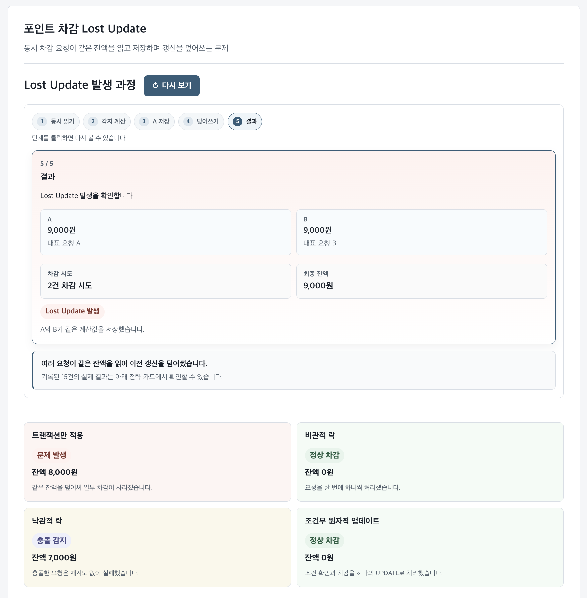

# Flash Concurrency Visualizer

Flash Coupon Payment 백엔드 프로젝트의 동시성 실험 결과를 설명하기 위한 보조 시각화입니다.

이 Visualizer는 [Flash Coupon Payment](https://github.com/roarjang/coupon-concurrency-lab)에서 수행한 백엔드 동시성 테스트와 문서화된 관측 결과를 읽기 쉽게 정리합니다. 정합성 검증은 Visualizer가 아니라 백엔드 JUnit 테스트, 최종 PostgreSQL persisted state, Redis 상태 확인을 기준으로 합니다.

같은 동시 요청 조건에서 여러 전략을 비교하는 이유는 각 전략이 무엇을 보장하고, 어디서 한계가 시작되는지 확인하기 위해서입니다.

## Live Demo

https://concurrency-visualizer.vercel.app

## Preview



## 백엔드 실험에서 시각화한 문제

### Point Lost Update

- **문제**: 여러 요청이 같은 포인트 잔액을 읽고 수정하면서 이전 갱신을 덮어씁니다.
- **일관성 기준**: 최종 잔액은 성공한 차감 횟수와 일치하고 음수가 되지 않아야 합니다.
- **기록된 관측 결과**: `Point.@Version` 적용 전, 잔액 `10,000원`에 `1,000원` 차감 요청 15건을 동시에 실행했을 때 15건이 성공 처리됐지만 최종 잔액은 `8,000원`이었습니다.

### Coupon Overselling

- **문제**: 여러 발급 요청이 같은 재고를 동시에 확인해 실제 재고보다 많은 발급 기록을 만듭니다.
- **일관성 기준**: 발급 기록 수와 `Coupon.issuedQuantity`는 `Coupon.totalQuantity`를 초과하지 않아야 합니다.
- **기록된 관측 결과**: `Coupon.@Version` 적용 전, 재고 100장에 서로 다른 사용자 1,000명이 동시에 요청했을 때 발급 기록은 1,000건이지만 `issuedQuantity`는 100으로 남았습니다.

### Duplicate Coupon Issuance

- **문제**: 같은 사용자의 동시 요청이 애플리케이션 중복 확인을 함께 통과합니다.
- **일관성 기준**: 같은 `(user_id, coupon_id)` 조합은 한 건만 존재해야 합니다.
- **기록된 관측 결과**: DB UNIQUE 적용 전, 같은 사용자가 같은 쿠폰을 100번 동시에 요청했을 때 허용 수량은 1건이지만 발급 기록 10건이 생성됐습니다.

## 실험 방식

Flash Coupon Payment 백엔드에서는 각 시나리오를 다음 순서로 검증했습니다.

1. 동시 요청을 정렬해 실패 조건을 재현합니다.
2. Transaction only 상태의 최종 PostgreSQL 데이터를 확인합니다.
3. 동시성 제어 전략을 하나씩 적용합니다.
4. 성공·실패 요청 수뿐 아니라 최종 잔액, 재고 수량, 발급 기록 수를 함께 검증합니다.
5. 같은 동시 요청 조건에서 전략이 보장하는 범위와 trade-off를 비교합니다.

실패 재현 결과는 현재 코드 상태를 추측한 값이 아니라, 테스트와 문서에 남아 있는 기록된 실험 결과입니다.

## 비교한 전략

| 대상 | 전략 | 핵심 역할 |
| --- | --- | --- |
| Point | Transaction only | `@Transactional`만 적용한 Lost Update 기준 시나리오 |
| Point | Pessimistic Lock | `PESSIMISTIC_WRITE`로 같은 row의 수정을 직렬화 |
| Point | Optimistic Lock | `@Version` mismatch로 stale update를 감지하고 거부 |
| Point | Atomic Update | 잔액 조건 확인과 차감을 하나의 `UPDATE`로 처리 |
| Coupon | Transaction only | 재고 확인과 증가가 분리된 Overselling 기준 시나리오 |
| Coupon | Pessimistic Lock | 쿠폰 row를 잠가 재고 갱신을 직렬화 |
| Coupon | Optimistic Lock | version 충돌을 감지해 오래된 재고 갱신을 거부 |
| Coupon | Atomic Update | 재고 조건과 발급 수량 증가를 하나의 `UPDATE`로 처리 |
| Duplicate | Transaction only | 애플리케이션 중복 확인만 적용한 기준 시나리오 |
| Duplicate | Unique Constraint | `(user_id, coupon_id)`의 최종 유일성을 PostgreSQL에서 강제 |
| Redis | Counter | 재고 슬롯을 PostgreSQL 저장 전에 선행 승인 |
| Redis | Lua Script | 재고 슬롯과 사용자 중복을 Redis 내부에서 함께 선행 확인 |

`Optimistic Lock`은 충돌을 감지하지만, retry가 없으면 성공 요청 수가 실행 스케줄링에 따라 달라질 수 있습니다. 따라서 기록된 수치는 실행 예시이며 모든 실행에서 같은 성공 수를 보장하지 않습니다.

## 주요 결과

- `@Transactional`은 요청별 commit/rollback 경계를 제공하지만, 같은 row의 동시 갱신까지 자동으로 막지는 않습니다.
- Pessimistic Lock은 같은 row 갱신을 직렬화하지만 충돌이 많으면 lock 대기가 늘어날 수 있습니다.
- Optimistic Lock은 조용한 덮어쓰기를 version 충돌로 바꾸지만, retry 정책이 없으면 일부 요청은 실패합니다.
- Atomic Update는 단순한 수량 조건을 한 SQL 문으로 처리할 때 효과적입니다.
- Unique Constraint는 애플리케이션 조회가 놓칠 수 있는 중복을 DB에서 최종 차단합니다.
- Redis는 DB 저장 전 예비 승인을 제공하지만, 최종 발급 여부는 PostgreSQL 저장 결과를 기준으로 판단합니다.

결론적으로 하나의 전략이 모든 동시성 문제를 해결하지 않습니다. 보호해야 하는 일관성 기준, 충돌 빈도, retry 허용 여부, lock 대기, 쿼리 복잡도에 따라 선택이 달라집니다.

## 보조 시각화가 보여주는 것

### 빠르게 읽는 비교 화면

Point, Coupon, Duplicate를 세 개의 실험 탭으로 나누고, 선택한 문제의 핵심 결과를 몇 초 안에 파악할 수 있도록 구성했습니다.

- 모든 전략 결과를 동시에 보여주는 간결한 비교 카드
- 문제 상태와 결과 수치를 먼저 읽는 시각적 계층
- 실험 조건, 전략 설명, 근거 자료는 접힌 disclosure로 분리

### Point Lost Update 재생

Lost Update는 발생 원인을 쉽게 이해할 수 있도록 대표 요청 A와 B의 5단계 개념 playback을 제공합니다.

1. A와 B가 같은 `10,000원`을 읽습니다.
2. 두 요청이 각각 `9,000원`을 계산합니다.
3. A가 `9,000원`을 저장합니다.
4. B가 A의 변경을 모른 채 같은 값을 저장합니다.
5. 두 대표 요청이 같은 계산값을 저장해 개념상 잔액이 `9,000원`으로 남는 흐름을 보여줍니다.

Playback은 실제 15건 동시 실행을 그대로 재생하는 기능이 아니라 원인 설명용 개념 흐름입니다. 실제 15건의 기록 결과와 전략별 결과는 comparison card에서 확인할 수 있습니다.

### Coupon과 Duplicate 비교

- Coupon은 재고 100장과 발급 기록 1,000건을 먼저 보여준 뒤 네 가지 DB 전략을 비교합니다.
- Duplicate는 허용 1건과 발급 기록 10건을 보여준 뒤 Transaction only와 Unique Constraint를 비교합니다.
- 두 화면 모두 추가 조작 없이 모든 전략 결과를 정적으로 비교합니다.

### Redis 선행 승인 경계

Redis는 별도 실험이 아니라 Coupon과 Duplicate의 후속 아키텍처 설명으로 표현합니다.

- Coupon: `1,000건 요청 → Redis 승인 100건 → Redis Counter → PostgreSQL 저장`
- Duplicate: `100건 요청 → Redis 승인 1건 → Redis Lua Script → PostgreSQL 저장`

Redis 승인은 발급 완료가 아닙니다. PostgreSQL의 조건부 재고 갱신과 `IssuedCoupon` 저장이 완료되어야 최종 발급 기록이 됩니다.

## 구성

```text
Backend JUnit concurrency tests
        ↓
검증된 실험 데이터와 근거 자료
        ↓
보조 comparison UI와 Point 개념 playback
```

Visualizer는 backend API를 호출하거나 브라우저에서 부하 테스트를 실행하지 않습니다. 표시된 수치는 백엔드 테스트, 구현 코드, repository query, entity constraint, 실험 문서에 기록된 결과를 정리한 것입니다.

## UI 범위

- 백엔드 실험 결과를 빠르게 읽기 위한 정적 React UI입니다.
- Point playback은 개념 설명이며 실제 부하 테스트나 시뮬레이션이 아닙니다.
- 모바일 320px부터 읽을 수 있도록 responsive layout을 지원합니다.

## 기술 스택

### Visualizer

- React 19
- TypeScript
- Vite
- CSS
- ESLint

### 실험 백엔드

- Java 21
- Spring Boot
- Spring Data JPA
- PostgreSQL
- Redis
- JUnit 5
- Gradle
- Docker Compose

## 로컬 실행

```bash
npm install
npm run validate:data
npm run dev
```

품질 확인:

```bash
npm run lint
npm run build
npx tsc --noEmit
```

## 문서

### 프로젝트 개요와 아키텍처

- [Backend 프로젝트 개요](https://github.com/roarjang/coupon-concurrency-lab/blob/main/README.md)
- [Architecture](https://github.com/roarjang/coupon-concurrency-lab/blob/main/docs/architecture.md)
- [Coupon Domain Design](https://github.com/roarjang/coupon-concurrency-lab/blob/main/docs/coupon-domain-design.md)

### 실험 계획

- [Point 동시성 실험 계획](https://github.com/roarjang/coupon-concurrency-lab/blob/main/docs/history/concurrency-experiment-plan.md)
- [Coupon 동시성 실험 계획](https://github.com/roarjang/coupon-concurrency-lab/blob/main/docs/history/coupon-concurrency-experiment-plan.md)

### 전략 비교

- [Point Concurrency Strategy Comparison](https://github.com/roarjang/coupon-concurrency-lab/blob/main/docs/point-concurrency-strategy-comparison.md)
- [Coupon Concurrency Strategy Comparison](https://github.com/roarjang/coupon-concurrency-lab/blob/main/docs/coupon-concurrency-strategy-comparison.md)
- [Redis/PostgreSQL Consistency Boundary](https://github.com/roarjang/coupon-concurrency-lab/blob/main/docs/redis-consistency-boundary.md)

### 실행과 검증

- [Concurrency Experiment Runbook](https://github.com/roarjang/coupon-concurrency-lab/blob/main/docs/runbook.md)
- [Visualizer 정적 실험 데이터](docs/experiment-data.md)

## 프로젝트 범위

이 저장소는 Flash Coupon Payment 백엔드 포트폴리오의 보조 자료입니다. 실제 고객 트래픽을 처리하는 운영 commerce system, 성능 benchmark, 또는 독립적인 프론트엔드 포트폴리오 프로젝트가 아닙니다.
